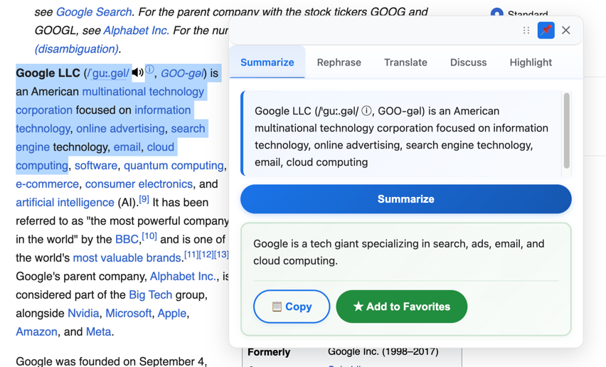

# AI Text Tools - Chrome Extension

<p align="center">
  
</p>


**An intelligent Chrome extension that leverages Google's Gemini AI to enhance text processing capabilities directly in your browser.**

<p align="center">
  
</p>

## 🎯 Overview

AI Text Tools transforms how users interact with web content by providing instant AI-powered text analysis, summarization, translation, and intelligent highlighting. Built for the Google Chrome Built-in AI Challenge 2025, this extension demonstrates the power of integrating advanced AI capabilities into everyday browsing experiences.

## ✨ Key Features

### 🤖 AI-Powered Text Processing
- **Smart Summarization** - Extract key insights with multiple styles (brief, detailed, bullet-points)
- **Intelligent Rephrasing** - Rewrite content in various tones (casual, formal, professional, friendly, academic)
- **Multi-Language Translation** - Real-time translation with auto-detection and formatting preservation
- **Contextual Highlighting** - AI-driven keyword and sentence highlighting on any webpage
- **Interactive Chat** - Engage in natural conversations about selected text

### 🚀 Advanced Capabilities
- **Streaming Responses** - Real-time text generation for seamless user experience
- **Comprehensive History** - Track and manage all AI interactions
- **Smart Favorites** - Save important results for quick access
- **Text-to-Speech** - Audio playback of AI-generated content in multiple languages
- **Keyboard Shortcuts** - Efficient workflow with customizable hotkeys
- **Multi-Language Support** - Interface available in English, German, French, Chinese, and Russian

### 🔧 Technical Excellence
- **Secure Architecture** - Local storage with Chrome's security standards
- **Cross-Site Compatibility** - Works seamlessly on all websites
- **Responsive Design** - Optimized for all screen sizes and devices
- **Extensive Customization** - Comprehensive settings and configuration options
- **Performance Optimized** - Fast, efficient processing with minimal resource usage

## 🚀 Quick Start

### Prerequisites
- Google Chrome browser (version 88 or higher)
- Google Gemini API key ([Get free API key](https://aistudio.google.com/app/apikey))

### Installation

1. **Clone the repository**
   ```bash
   git clone https://github.com/Faxziah/chrome_ai.git
   cd chrome_ai
   ```

2. **Install dependencies**
   ```bash
   npm install
   ```

3. **Build the extension**
   ```bash
   npm run build
   ```

4. **Load in Chrome**
   - Open Chrome and navigate to `chrome://extensions/`
   - Enable "Developer mode" in the top right
   - Click "Load unpacked" and select the project folder
   - The extension will appear in your Chrome toolbar

5. **Configure API Key**
   - Click the extension icon in your toolbar
   - Navigate to the "Settings" tab
   - Enter your Gemini API key
   - Configure AI model settings (temperature, max tokens)
   - Click "Save" to activate the extension

## 🧪 Testing Instructions for Judges

This extension is ready for testing and evaluation. Follow these steps to install and test the application:

### Quick Installation (5 minutes)

1. **Download the project**
   - Clone the repository: `git clone https://github.com/Faxziah/chrome_ai.git`
   - Or download as ZIP from GitHub and extract it

2. **Build the extension** (if not already built)
   ```bash
   cd chrome_ai
   npm install
   npm run build
   ```

3. **Load in Chrome Developer Mode**
   - Open Google Chrome
   - Navigate to `chrome://extensions/`
   - Enable **"Developer mode"** (toggle in top right corner)
   - Click **"Load unpacked"**
   - Select the `chrome_ai` folder (the folder containing `manifest.json`)
   - Extension will appear in your Chrome toolbar

4. **Get API Key** (Required for functionality)
   - Visit [Google AI Studio](https://aistudio.google.com/app/apikey) (free)
   - Sign in with Google account
   - Click "Create API Key"
   - Copy the API key

5. **Configure the Extension**
   - Click the extension icon in Chrome toolbar
   - Go to **"Settings"** tab
   - Paste your Gemini API key
   - Click **"Save"**
   - Extension is now ready to use!

### Testing the Application

The extension works on **any webpage**. Here's how to test all features:

1. **Text Summarization**
   - Visit any article or webpage (e.g., news site, blog)
   - Select a paragraph of text
   - Right-click → "Summarize text"
   - View the AI-generated summary in the popup

2. **Text Rephrasing**
   - Select text on a webpage
   - Right-click → "Rephrase text"
   - Choose tone: casual, formal, professional, friendly, or academic
   - See the rephrased version instantly

3. **Translation**
   - Select text in any language
   - Right-click → "Translate text"
   - Select target language
   - View translated text with formatting preserved

4. **AI Chat**
   - Select text on a webpage
   - Right-click → "Discuss with AI"
   - Chat naturally about the selected text
   - Ask questions, get insights

5. **AI Highlighting**
   - Press `Ctrl+Shift+K` (Windows/Linux) or `Cmd+Shift+K` (Mac)
   - AI automatically highlights key sentences and keywords
   - Press `Ctrl+Shift+L` to clear highlights

6. **Additional Features**
   - Click extension icon → View history of all AI interactions
   - Save favorite results for quick access
   - Use text-to-speech to hear AI responses
   - Change interface language (English, German, French, Chinese, Russian)

### Test Credentials (if needed)

If you encounter any issues or need a test API key for evaluation:
- The extension requires a valid Google Gemini API key
- API keys are free and can be obtained in 2 minutes at [aistudio.google.com/app/apikey](https://aistudio.google.com/app/apikey)
- No login credentials needed - the extension is fully functional once API key is configured

### Troubleshooting

- **Extension not loading?** Make sure Developer mode is enabled in `chrome://extensions/`
- **API errors?** Verify your API key is correct in Settings
- **Features not working?** Ensure you've built the extension with `npm run build`
- **Build issues?** Check Node.js version (requires 18+)

The extension is fully functional and ready for evaluation. All code is open source and available in this repository.

## 📖 Usage Guide

### Text Processing Workflow
1. **Select any text** on a webpage
2. Access context menu options:
   - Summarize text
   - Rephrase text
   - Translate text
   - Discuss with AI
   - Highlight key paragraphs
3. **View results** in the popup interface
4. **Save to favorites** or view history for future reference

### Keyboard Shortcuts
- `Ctrl+Shift+K` (or `Cmd+Shift+K` on Mac) - Highlight keywords
- `Ctrl+Shift+L` (or `Cmd+Shift+L` on Mac) - Clear highlights

## 🏗️ Technical Architecture

### Project Structure
```
src/
├── components/          # Core business logic components
│   ├── chat.ts         # AI chat interface
│   ├── summarizer.ts   # Text summarization logic
│   ├── translator.ts   # Translation services
│   ├── rephraser.ts    # Text rephrasing logic
│   └── tabs.ts         # Tab management
├── content/            # Content script implementations
│   ├── content-script.ts
│   ├── highlight.ts    # AI-powered highlighting
│   ├── popup-ui.ts     # Popup interface
│   ├── handlers/       # Event handlers
│   └── speech-utils.ts # Text-to-speech utilities
├── services/           # Core services and APIs
│   ├── gemini-api.ts   # Gemini AI integration
│   ├── storage.ts      # Data persistence
│   ├── history.ts      # History management
│   └── favorites.ts    # Favorites system
├── popup/              # Extension popup interface
├── options/            # Settings and configuration
├── sidepanel/          # Side panel interface
├── utils/              # Utility functions
│   └── i18n.ts         # Internationalization
└── types/              # TypeScript definitions
```

### Technology Stack
- **TypeScript** - Type-safe development with comprehensive type definitions
- **Chrome Manifest V3** - Latest extension standard with enhanced security
- **Google Gemini API** - Advanced AI processing and generation
- **Rollup** - Efficient module bundling and optimization
- **Material Design** - Modern, accessible UI framework
- **Web Speech API** - Cross-platform text-to-speech functionality

## 🔧 Development

### Prerequisites
- Node.js 18+ 
- npm or yarn
- Google Chrome browser

## 🔐 Security & Privacy

### Data Protection
- **Local Storage Only** - All data stored locally using Chrome's secure storage
- **No External Tracking** - Zero user behavior monitoring or data collection
- **API Key Security** - Secure local storage of credentials with no external transmission
- **Open Source** - Transparent, auditable codebase

### Privacy Compliance
- **GDPR Compliant** - No personal data collection or processing
- **Chrome Web Store Standards** - Full compliance with extension policies
- **User Control** - Complete user control over data and API usage

## 🌍 Internationalization

### Supported Languages
- English (en)
- German (de)
- French (fr)
- Chinese (zh)
- Russian (ru)

### Challenge Alignment
- ✅ **AI Innovation** - Advanced Gemini API integration with streaming responses
- ✅ **User Experience** - Intuitive, accessible interface design
- ✅ **Performance** - Optimized for speed and efficiency
- ✅ **Accessibility** - Multi-language support and keyboard navigation
- ✅ **Technical Excellence** - Modern architecture with comprehensive testing

### Unique Value Proposition
- **First-of-its-kind** AI-powered webpage highlighting
- **Seamless integration** with existing browsing workflows
- **Multi-modal AI interaction** (text, speech, visual)
- **Enterprise-ready** security and privacy standards

## 📄 License

This project is licensed under the MIT License - see the [LICENSE](LICENSE) file for details.

**Built with ❤️ for the Google Chrome Built-in AI Challenge 2025**

*Transforming web browsing through intelligent AI integration*